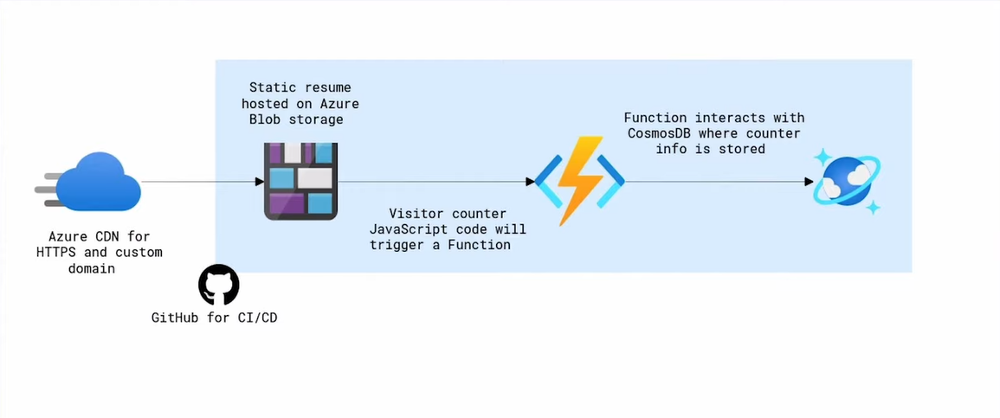
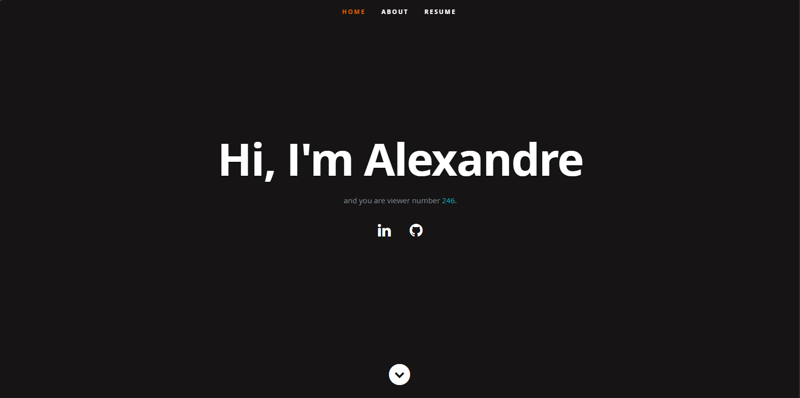

# Azure Resume Challenge:

My own Azure resume, following [ACG project video](https://www.youtube.com/watch?v=ieYrBWmkfno).  
Link to it: [My Resume Website](https://www.alexandrepereira.site/).

## Diagram:



## Overview:

  - The blob storage will hold our static website (The resume).
  - The website is made of HTML, CSS & JavaScript.
  - The Javascript is going to be used to implement a visitor counter.
    - It will display the information and call an API, which we're going to implement with an Azure function.
      
  - The Azure function is then going to interact with Azure Cosmos DB.
    - This is the database service we'll be using to store our visitor counter.
      
  - We're going to be using Azure CDN to enable features like HTTPS and custom domain support for our static website.
  - For all the CI/CD tooling, we're going to be using GitHub.

## Example of end result:



## Prerequisites:

- Created a [GitHub account](https://github.com/join).
  - To deploy all the files through CI/CD.

- Created an [Azure account](https://azure.microsoft.com/en-us/free).
  - To deploy the website and Azure services.

- Installed [Azure CLI](https://docs.microsoft.com/en-us/cli/azure/install-azure-cli).
  - Used to create/manage Azure resources locally.

- Installed [.NET Core 6 LTS](https://dotnet.microsoft.com/download/dotnet/6.0).
  - The framework to be used to develop the Azure Function.

- Installed [Azure Functions Core Tools](https://docs.microsoft.com/en-us/azure/azure-functions/functions-run-local?tabs=macos%2Ccsharp%2Cbash#install-the-azure-functions-core-tools).
  - To develop and test functions on the local computer.

- Installed the latest stable [Visual Studio Code](https://code.visualstudio.com).
  - The code editor used for the frontend and backend programming.

- Installed the following [Visual Studio Code Extensions](https://code.visualstudio.com/docs/introvideos/extend):

  - [Azure Functions](https://marketplace.visualstudio.com/items?itemName=ms-azuretools.vscode-azurefunctions).
    - To create, debug, manage and deploy serverless apps directly from VS Code.

  - [C#](https://marketplace.visualstudio.com/items?itemName=ms-dotnettools.csharp).
    - To have support and be able to program in C#.

  - [Azure Storage](https://marketplace.visualstudio.com/items?itemName=ms-azuretools.vscode-azurestorage).
    - To deploy the static website.

## 1. Building the frontend:   

    - Set up version control:

      - Created a GitHub repository & cloned it to a local repo by using SSH ([How To Git Clone, Push, and Pull Over SSH](https://www.warp.dev/terminus/git-clone-ssh)).
      - Went to the following repo ([frontend & backend folders](https://github.com/ACloudGuru-Resources/acg-project-azure-resume)). and cloned the starter code in to another local repo.
      - I then copied the frontend and backend folders from one local repo to another.
      - The frontend folder has the following: css folder, images folder, javascript folder & index.html file.
      - The backend folder has the following: api & tests folders.
      - We can add a README.md file in each folder to add more more individual details.
      - The website will be hosted in the frontend folder and the Azure function will be in the api folder.
      - Once we implement tests, it will be in the tests folder.

    - Update the HTML and implement a counter:

      - Here we updated the HTML with our own resume information.
      - We also write the javascript code for the visitor counter functionality.
      - We go to the file index.html in the frontend folder and change the content to match our resume.
      - We can view the website by opening the index.html file.
      - Created frontend/main.js and wrote in it the JavaScript code that shows the counter data in the website.
        - It will grab the JSON that is given by the function API and show it in the HTML where id="counter".
        - This [article](https://www.digitalocean.com/community/tutorials/how-to-use-the-javascript-fetch-api-to-get-data) explains how to make an API call with JavaScript by using the Fetch API.
            
    - Viewed the website locally and pushed all the changes to GitHub.

## 2. Building the backend:

  ```
        § I used terraform to create the CosmosDB and Function.
          ® I also created a storage account, app insights and service plan.
          
        § For that I also created a service principal through the Azure CLI.
          ® Copied the output and added the values as a secrets in the repository.
          
        § Added a contributor role to the service principal on the subscription to which the resources are created.
          ® Stored the JSON information in the GitHub repository secrets tab.
        
        § CosmosDB:
        
          □ Created a Cosmos DB account, database & container.
          □ Manually added the following data inside a container item:
            
            {
              "id": "1",
              "count": 0
            }
          
        § Function:
      
          □ It is a serverless solution that allows us to create pieces of code that are event driven.
            ® Therefore we don't have to worry about the infrastructure behind those pieces of code.
          
          □ It also has a feature called bindings that allow us to connect other services to it.
            ® This will allow us to connect the CosmosDB bindings to the function.
            ® This allows us to view our counter data via the function.
        
          □ Created a local Azure Function via VS Code.
            ® This is done by going to the Workspace tab in the Azure section and selecting the function icon -> New Project.
            ® We then choose:
            
              ◊ Language: "C#";
              ◊ Runtime: ".Net Core 6.0";
              ◊ Template: "HTTP Trigger";
              ◊ Name: "Get_Resume_Counter";
              ◊ Default name space: "Company.Function";
              ◊ Access rights: "Function".
              
            ® I named it "Get_Resume_Counters.cs".
            ® This will create a file in the backend/api folder with the functions code.
            ® An ([HTTP trigger])(https://learn.microsoft.com/en-us/azure/azure-functions/functions-bindings-http-webhook-trigger?tabs=python-v2%2Cisolated-process%2Cnodejs-v4%2Cfunctionsv2) is used to invoke the Function with an HTTP request.
            
          □ Accessed the backend/api folder and ran "func host start".
            ® I was having na issue where "" wasn't found.
              ◊ To fix that i added this command: dotnet nuget add source https://api.nuget.org/v3/index.json -n nuget.org
              ◊ This adds the package source for it to install the missing package.
              
            ® This is to verify that the function works locally.
            ® It gives us a local URL to go to and see if it works.
          
          □ To configure bindings on the Function app, we need to install the appropriate package for it to work with CosmosDB.
            ® In this case NuGet package ([NuGet Gallery | Microsoft.Azure.Functions.Worker.Extensions.CosmosDB 4.10.0])(https://www.nuget.org/packages/Microsoft.Azure.Functions.Worker.Extensions.CosmosDB/).
            ® Go in to the backend/api.
            ® Then run the command: dotnet add package Microsoft.Azure.Functions.Worker.Extensions.CosmosDB --version 4.10.0
          
          □ I then added the following in the "api.csproj" file to include the CosmosDB binding: <PackageReference Include="Microsoft.Azure.WebJobs.Extensions.CosmosDB" Version="4.8.0" />
            ® This is because I was getting an error about not having the correct veresion for it.
            
          □ Went inside the local.settings.json file.
            ® It is where we can save secrets and keys that we need to work.
            ® This file only remains localy.
            ® The .gitignore file won't send it to the repo.
            ® In it we add a "key:value" pair with the CosmosDB primary connection string.
              ◊ Example: "AzureResumeConnectionString": "Connection string".
          
          □ We can now configure the bindings in the code to retrieve and update the counter data.
            ® To do so we first need to add a C# class in "Get_Resume_Counter.cs".
            ® This is where we describe the counter object.
            
          □ To do so we create in backend/api a new file called "Counter.cs".
            ® This is to get and set the information from the CosmosDB.
            ® We make it have the same namespace as the previous function.
            ® We also configure it to receive the values from the JSON inside the container in the Cosmos DB name.
            ® We can now create the Cosmos DB bindings.
        
          □ in the Get_Resume_Counter.cs file is where we add the CosmosDB bindings.
        
        § Class:
        
          □ We first need to remove the async from the class to allow the class to do both things at the same time.
          □ We then create a public static "HttpResponseMessage" to run the bindings.
          □ For this to work we need to add the library "System.Net.Http;"
        
        § First binding:
        
          □ In it we include the Database Name, container name, the connection string the ID value of what we want to retrieve and partition key.
          □ We then store it in the Counter counter.
          □ The connection string is a var that will get the value from the "local.settings.json" file.
          □ This binding will allow us to retrieve an item that has the ID of 1.
        
        § Second binding:
        
          □ This will allow us to increase na additional visit to the counter.
          □ It is the same as the above but with a diferent end var.
      
          □ ([Azure Functions Cosmos DB bindings](https://learn.microsoft.com/en-us/azure/azure-functions/functions-bindings-cosmosdb-v2?tabs=isolated-process%2Cextensionv4&pivots=programming-language-python)
          
          □ ([Retrieve a Cosmos DB item with Functions binding])(https://learn.microsoft.com/en-us/azure/azure-functions/functions-bindings-cosmosdb-v2-input?tabs=python-v2%2Cisolated-process%2Cnodejs-v4%2Cextensionv4&pivots=programming-language-python)

          □ ([Write to a Cosmos DB item with Functions binding])(https://learn.microsoft.com/en-us/azure/azure-functions/functions-bindings-cosmosdb-v2-output?tabs=python-v2%2Cisolated-process%2Cnodejs-v4%2Cextensionv4&pivots=programming-language-python)
          
        § The code to retrieve the counter, update the counter and return it as JSON.
        § We then have a log information output to inform us that it did something.
        § The input binding will grab and populate the "Counter" object when the function is executed.
        § "updatedCounter" doesnt get updated because its an output.
        § After that we run the function locally we can see that the counter goes up every time we refresh the website.
        § We can then go to the database and see the count incremented.
  ```

### 2. Connecting the frontend with the backend:
    
  ```
      § Here we are going to the main.js file and update the API URL with the functions local URL.
      § Then we run the function locally and open the index.html to make sure we can view the counter data.
        □ We do that by adding na entry in our "local.settings.json" file.
      
      § We then run in the backend/api folder: func host start
        □ We verify if the counter is working.
      
      § Then we go to the main.js file and add the localhost to the functionApi var.
        □ This is for the index.html to be able to read the counter and add it to the website.
  
      § Altered the API URL to the Functions local URL.
      § For this to work we need to enable ([CORS])(https://github.com/Azure/azure-functions-host/issues/1012) so that it works with the local Function host.
      
      § Executed: func host start
        □ Verified that the counter in the HTML increased with every refresh.
        
      § When we access the website the following happens:
        1) Function is triggered.
        2) It retrieves the CosmosDB item.
        3) Adds +1 to counter.
        4) Sends it to the website and the CosmosDB.
  ```

### 3. Deploying to Azure:
  
  ```
      § Went to the root of the repo and sent it github.
      § Signed in with my Azure account in VS Code.
      § Went to the Function project that we created in VS Code and deployed it to the function in Azure.
        □ "func host start" needs to be run in "backend\api" before doing this.
        
        □ Note: In case its trying to deploy a function from another folder, do the following.
          ® Open the command palette (Ctrl + Shift + P).
          ® Type and select "Preferences: Open Workspace Settings (JSON)".
          ® Look for any settings related to Azure Functions or deployment paths and remove any references to the deleted folder.
          
      § Go to the deployed function and copy its default URL.
      § We then create a new var im main.js wit this URL.
        □ We then change the code to use this car instead of the local one.
      
      § We then enable CORS in Azure so that the website can communicate with the function.
        □ CORS (Cross-Origin Resource Sharing) allows JavaScript code running in a browser on an external host to interact with your backend, in this case the function.
        □ We previously did it in the local file but that isnt pushed to the repo, it is local for local testing.
        □ Azure -> Function App -> CORS.
        □ We enable it and just leave it empty for later.
        □ We will then change it to have the website URL to allow its connection.
      
      § We can copy the URL of Function and access it in the browser to check if its working.
      
      § We are now going to add the connection string of the CosmosDB connection to the function.
      § This is a way to store private information.
      § Azure key vault is a better option.
        □ Go to Azure -> Function -> Environment variables -> New Application Setting.
          ® Name: AzureResumeConnectionString
          ® Value: The connection string.
  
      § We then deploy the frontend folder to an azure static website via azure storage.
        □ First we change the var in main.js to use the Function API URL.
        □ Then we right click the folder.
        □ We then select the storage created by terraform.
        □ We then select the index.html file.
        □ We can then browse to the website by clicking on the pop up that shows up in VS Code.
  
      § After doing so we will notice that the counter isn't working on the website.
        □ We can verify this in the web developer tools section in the browser.
        □ It will say the it cant fetch the counter.
      
      § This is because we haven't added the blob website URL to CORS in the function.
        □ After we add it, the website will be able to reach it.
        □ It may take a few minutes.
  
      § Enabling custom domain and SSL certificates:
      
        □ We'll be using Azure CDN (Content Delivery Network).
          ® This will cache the content of the website and provide low latency to it all over the world.
          ® It can also provision TLS certificates to our website and therefore enable HTTPS support.
          ® It also allows us to map a custom domain to it.
      
        □ All of the configurations are done via terraform.
        □ We then go to Azure -> the Front Door & CDN resource profile resource -> Our hostname -> Origins.
          ® We then change the origin type to "Storage static website" and we select our storage account website as the origin.
        
        □ We then go to Azure -> the Front Door & CDN resource profile resource -> Our hostname -> Custom domains.
          ® We then add our custom domain to it.
            ◊ For domain name I used namecheap.
            ◊ In it i bought a domain and then created a CNAME record with the domain of the CDN endpoint hostname.
            ◊ We then validate and wait, this may take up to 10 min. 
    
          ® After its done we can access our website.
            § If we do HTTP it will give na error saying "Page not found".
            § If we do HTTPS it will give a certificate error, saying that the domain isn't valid.
          
          ® After that we go back to our custom domain and set:
            ◊ Custom domain HTTPS: "On";
            ◊ CDN management type: CDN managed;
            ◊ Minimum TLS version: TLS 1.2.
          
          ® We then validate and wait, this may take up to 10 min. 
          ® When its done we can access our custom domain on the web via HTTPS.
          ® The visitor count wont work because CORS doesnt have this new URL.
            ◊ Therefore we go back and add it.
  
      § Caching and purging:
      
        □ Caching: It is the process of storing copies of files in a cache, or temporary storage location, so that it can be accessed more quickly.
        □ Purging: It is the process of removing cached content before the predetermined expiry date.
        □ Purge as part of CI/CD: Incorporating a purge in the pipeline since it's a good practice to ensure visitors get the most up to date assets.
  ```

### 4. Building CI/CD pipeline with GitHub:
    
  ```
      § This will use the service principal that was used for the terraform creation.
        □ Its credentials are in github secret "AZURE_CREDENTIALS".
        
      § We first create our frontend workflow.
        □ This will deploy any changes to the frontend folder.
        □ Set up a ([GitHub Actions workflow)](https://learn.microsoft.com/en-us/azure/storage/blobs/storage-blobs-static-site-github-actions?tabs=userlevel) in frontend.main.yml to deploy the frontend static website.
    
      § We then create our backend workflow.
        □ This will deploy any changes to the backend folder.
        □ This includes our Azure function and any changes to our tests.
        □ Implemented a ([CI workflow in GitHub Actions])(https://docs.github.com/en/actions/use-cases-and-examples/building-and-testing/building-and-testing-net) to build and test the .NET backend everytime a change is uploaded.
      
      § Why CI/CD is important:
      
        □ Version control: Track and manage changes to software code.
        □ Continuous Integration: Integrate code changes wehre build and tests can run.
        □ Continuous Delivery: Code that has passed testing is staged and ready to be pushed to production.
        □ Continuous Deployment: Optionally, code that has passed every stage can be automatically pushed to production.
        Importance: ([Unit tests])(https://dev.to/flippedcoding/its-important-to-test-your-code-3lid)
        
      § Unit tests:
        
        □ We then implement unit tests to test our Azure functions code in the backend.
        
        □ Why unit tests are important:
          
          ® It saves hours of debugging (Only code that passes the test is sent).
          ® Improved documentation (A unit test is a small piece of code that describes a user story or requirement).
          ® Write more efficient code (Helps to keep code simple because we write just enough code to pass the test).
          ® Reduces errors during deployments (We will catch any last-minute issues before we deploy).
          
        □ Moved in to the /backend/tests folder.
        □ Executed: dotnet new xunit
          ®This creates a test unit project (tests.csproj).
          ®([Getting Started with xUnit.net])(https://xunit.net/docs/getting-started/netcore/cmdline).
          ®([How to setup Xunit with Azure Functions])(https://www.madebygps.com/how-to-use-xunit-with-azure-functions/)
          
        □ Add a package: dotnet add package Microsoft.AspNetCore.Mvc
        □ Add a reference to the Function app: dotnet add reference ../api/api.csproj
        □ In tests.csproj we can see the package that was added and the reference to the api.csproj file.
        
        □ To test the files that were created for us: dotnet test
          ® This will use the tests/tests.csproj file that was created from the above test.
        
        □ It will then show if it passed or not.
          ® It will pass because the file UnitTests1.cs is empty and doesn't have tests to use.
          ® Deleted it because it because of that.
          
        □ Pasted the files in the ([starter code])(https://github.com/ACloudGuru-Resources/acg-project-azure-resume-starter/tree/main/tests) to the tests folder.
          ® They are mostly helper files.
          
        □ Accessed the TestCounter.cs file.
          ® For the test to pass the FACT needs to be true.
          ® It has na object of type counter.
            ◊ It has the same information as api/Counter.cs, therefore if it passes, the files are sent.
          
          ® We set the Id to 1.
          ® And we give a random count of 2.
          ® We then create na HTTP request.
          ® And then run the function that has the counter provided.
            ◊ It then outputs the counter.
            
          ® It should return the value 3.
          ® To test we go to backend/tests and execute: dotnet test
          ® We should also test if it fails.
            ◊ For example set the Equal to 4.
            ◊ This should fail because it will return 3.
          
        □ We now implement the unit tests to the backend workflow.
          ® Set up A ([GitHub Actions Workflow])(https://learn.microsoft.com/en-us/azure/azure-functions/functions-how-to-github-actions?tabs=windows%2Cdotnet&pivots=method-manual) to create the backend.main.yml.
  ```

### Steps of deployment:

  ```
    ○ The terraform configuration.
    ○ Deploy function with the CosmosDB URL as a secret.
    ○ Deploy the frlntend website with the Functions URL.
    ○ Enable a custom domain name with HTTPS support.
    ○ Add the custom domain the the Functions CORS.
  ```